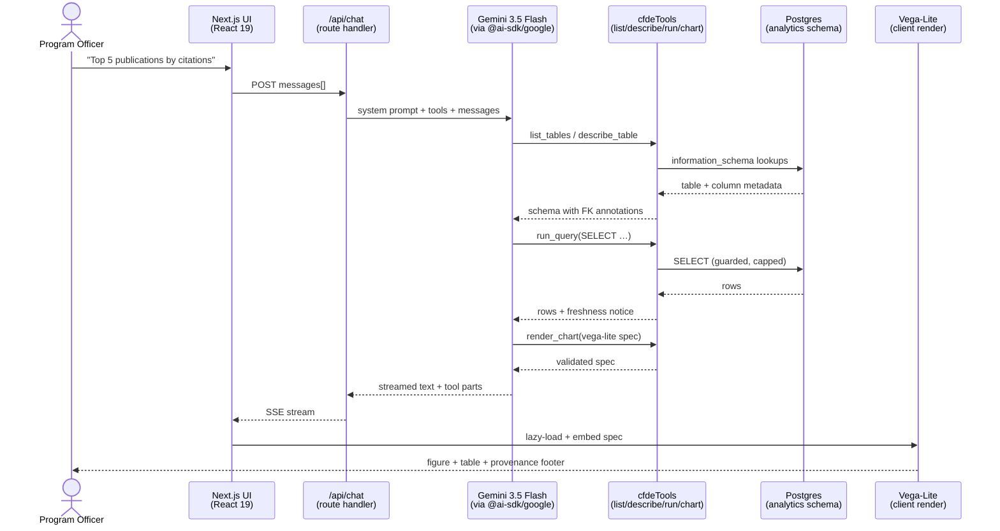
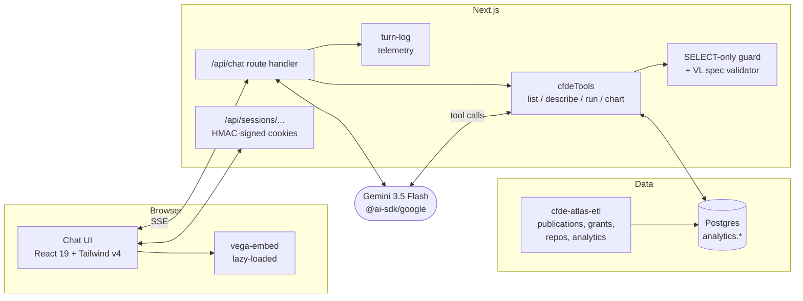

# cfde-atlas

> A conversational lens on Common Fund Data Ecosystem (CFDE) evaluation metrics — bibliometrics, grants, code activity, and web analytics — keyed by NIH core project number.

Built for **NIH program staff** preparing for the annual **Council of Councils** meeting. The deliverable is tables and figures suitable for leadership briefings; the chat surface is the means, not the artifact.

[](LICENSE)


---

## Features

- 💬 **Conversational query** — ask in plain English; no SQL, no notebook required.
- 🔧 **LLM-callable tools** — the model drives `list_tables`, `describe_table`, `run_query`, and `render_chart` to plan and execute multi-step answers.
- 📊 **Inline charts** — Vega-Lite figures rendered alongside the source table, every time.
- 📑 **GFM tables** in chat output, copyable into reports.
- 🧾 **Provenance footer** on every assistant response — model, data freshness, and a non-citation caveat.
- 🔗 **Shareable transcripts** — read-only links to the full back-and-forth (tool calls included).
- 📤 **Export-friendly** — output shaped for slide decks and program reports, not just screen reading.
- 🛡️ **SELECT-only SQL guard** — the query tool rejects anything that isn't a single read.

---

## Quickstart

```bash
git clone https://github.com/seandavi/cfde-atlas.git
cd cfde-atlas
npm install
echo "GOOGLE_GENERATIVE_AI_API_KEY=…" > .env.local
npm run dev
```

Open [http://localhost:3000](http://localhost:3000) and try one of the seeded prompts (e.g. *"Plot total FY2024 funding by CFDE program, horizontal bar, sorted descending."*).

### Environment

| Variable | Required | Purpose |
|---|---|---|
| `GOOGLE_GENERATIVE_AI_API_KEY` | yes | Gemini API access via `@ai-sdk/google`. |
| `DATABASE_URL` | not yet | Postgres connection. Wiring tracked in the open issues. |

---

## Architecture

A single Next.js deployment fronts a Gemini-driven tool loop against the CFDE evaluation database. No Python sidecar, no MCP server — schema introspection and query are LLM tools exposed via the AI SDK.

### Request flow



### Component view



The model plans a multi-step loop bounded by a step budget (currently 40) — it explores schema, drafts SQL, runs it, and decides whether a chart adds clarity. Both the SQL guard and the Vega-Lite validator return *specific* error messages so the model can self-correct mid-turn.

---

## Tech stack

### Frontend
- **Next.js 16** (App Router, Turbopack) — single deployment, server components, streaming responses.
- **React 19** with Server Components.
- **Tailwind v4** — utility-first styling, no design-system overhead.

### LLM layer
- **Vercel AI SDK v6** (`ai`, `@ai-sdk/google`, `@ai-sdk/react`) — provider-agnostic tool calling, streaming, UI message types.
- **Gemini 3.5 Flash** — 1M-token context, native function calling, cost profile sized for many ad-hoc queries.

### Data
- **Postgres** via `postgres.js` reading an **ELT-style** schema: sources land in `raw.*` as `jsonb`, transformations are `analytics.*` SQL views. Per-column `COMMENT ON COLUMN` text is part of the contract — it's what `describe_table` returns to the model.
- **[`cfde-atlas-etl`](https://github.com/seandavi/cfde-atlas-etl)** — Prefect/Python flows that land each source. Live flows: opportunities, projects, publications + iCite enrichment, journals (Scimago + Entrez), DRC assets, GitHub repos + activity + contributors, GA4 pageviews/top pages/geo/traffic-sources, citing publications, citing grants, citing-grant details.
- **[`nih-cfde/icc-eval-core`](https://github.com/nih-cfde/icc-eval-core)** — upstream reference set for the curated FOA / core-project list mirrored into `cfde-atlas-etl/config.yaml`.

### Rendering & content
- **Vega-Lite v5** via `vega-embed`, lazy-loaded so first paint stays light.
- **react-markdown** + **remark-gfm** for GFM tables in assistant output.

### Tooling
- **TypeScript** end-to-end.
- **Vitest** for unit tests (SQL guard, Vega validator, schema introspection).
- **ESLint** with project-specific rules for import style and date-stamp conventions.

---

## Data & provenance

> ⚠️ **Do not cite figures from this app in external materials yet.** All in-scope ETL flows have landed, but results have not been independently vetted for use in NIH leadership briefings. Every assistant response carries a provenance footer reflecting data freshness and this caveat.

All tables join on **NIH core project number** (e.g. `U54OD036472`) — the unit program officers actually navigate by. Sources that don't expose core-project linkage natively (raw GitHub repos, GA properties) go through a resolution step in `cfde-atlas-etl` before they land.

The CFDE FOA / core-project scope is **PR-curated** in `cfde-atlas-etl/config.yaml` — adding or removing a project is a code review with an audit trail, not a scrape.

---

## Status & roadmap

**App**
- [x] Conversational chat surface
- [x] Tool loop: `list_tables`, `describe_table`, `run_query`, `render_chart`
- [x] SELECT-only SQL guard + Vega-Lite spec validator
- [x] Shareable transcripts (HMAC-signed session cookies)
- [x] Data-freshness footer + non-citation provenance
- [ ] Production deploy

**Data flows** (`cfde-atlas-etl`)
- [x] Opportunities (PR-curated FOAs)
- [x] Projects (NIH RePORTER) + core-project rollups
- [x] Publications (RePORTER + iCite enrichment)
- [x] Journals (Scimago ranks + Entrez metadata)
- [x] Citation chain — citing publications, citing grants, downstream funding rollups
- [x] DRC assets (DCC, file, code manifests)
- [x] GitHub repos, weekly activity, contributors
- [x] Google Analytics — pageviews, top pages, geo, traffic sources, property coverage
- [ ] ORCID → core-project access mapping (for GA gating)
- [ ] Datasets-deposited metrics (GEO / dbGaP / Synapse / OSF) — the strongest "CFDE works" signal

See [BLUEPRINT.md](BLUEPRINT.md) for the full design rationale and the [`cfde-atlas-etl`](https://github.com/seandavi/cfde-atlas-etl) flows table for per-source contracts.

---

## Documentation

- **[BLUEPRINT.md](BLUEPRINT.md)** — durable design doc: purpose, audience constraints, architecture, model choice, tool contract, deploy story, gotchas. Read this before changing anything structural.
- **[docs/decisions/](docs/decisions/)** — Architecture Decision Records (ADRs). One file per substantive technical decision, with revisit triggers.
- **[CONTRIBUTING.md](CONTRIBUTING.md)** — dev setup, commit conventions, PR workflow.
- **[CODE_OF_CONDUCT.md](CODE_OF_CONDUCT.md)** — contributor expectations.
- **[CLAUDE.md](CLAUDE.md) / [AGENTS.md](AGENTS.md)** — guidance for AI agents working in this repo. Both files declare project-specific quirks (e.g. *"this is not the Next.js you know — read the local docs first"*).

---

## Related repositories

- [`cfde-atlas-etl`](https://github.com/seandavi/cfde-atlas-etl) — Python ETL that lands CFDE evaluation data into the `analytics.*` schema this app reads from.
- [`nih-cfde/icc-eval-core`](https://github.com/nih-cfde/icc-eval-core) — upstream CFDE evaluation data source consumed by `cfde-atlas-etl`.

---

## License

[MIT](LICENSE). Copyright (c) 2026 Sean Davis, NIH / CFDE Coordinating Center.
